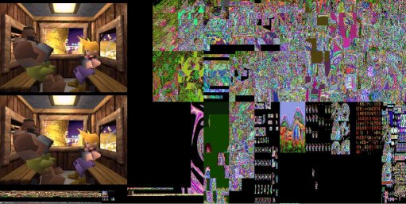

## RAM management

No matter what module is banked into memory, there is a section of memory 4,340 bytes long (0x10F4 bytes) that is reserved for all the variables for the entire game. This entire image is called the "[Savemap](../Savemap.md)". When it's time to save a game, this section of memory is copied to non-volatile ram, such as a hard disk or memory card.

Within the [Savemap](../Savemap.md) there are 5 banks of memory that are directly accessible by the [field scripting language](FF7/Field_script "wikilink"). These can either be accessed 8 bits or 16 bits at a time depending on the field command argument. The following table is basic memory map of the banks and how they relate to the [Savemap](../Savemap.md). There is also an allocation for 256 bytes for temporary field variables. These are not used between field files and are not saved.

| Offset | 8 Bit Field Bank | 16 Bit Filed Bank |                  Description                   |
|:------:|:----------------:|:-----------------:|:----------------------------------------------:|
| 0x0000 |       N/A        |        N/A        | Beginning of [Savemap](../Savemap.md) |
| 0x0BA4 |       0x1        |        0x2        |              Field Script Bank 1               |
| 0x0CA4 |       0x3        |        0x4        |              Field Script Bank 2               |
| 0x0DA4 |       0xB        |        0xC        |              Field Script Bank 3               |
| 0x0EA4 |       0xD        |        0xE        |              Field Script Bank 4               |
| 0x0FA4 |       0xF        |        0x7        |              Field Script Bank 5               |
| 0x10F4 |       N/A        |        N/A        |    End of [Savemap](../Savemap.md)    |

|     |     |     |                                       |
|-----|:---:|:---:|---------------------------------------|
| N/A | 0x5 | 0x6 | Temporary field variables (256 bytes) |

## VRAM management

The kernel is in charge of allocating, caching, and displaying in Video RAM. In the case of the PSX, port, the Playstation only has 1 megabyte of VRAM which makes this task a little complex. This is alleviated somewhat by using the PSX's VRAM caching system.

The PSX video memory can best be seen as a rectangular "surface" made up of 2048x512 pixels. A slight caveat to this model is that the PSX can hold multiple color depths in VRAM at the same time. To make the VRAM a little easier to visualize, This document represents VRAM as a 1024x512 matrix to allow for some color depth in either direction and to minimize some extreme skewing of the video buffers.

  
The following is a typical state of VRAM during game play.

The two game screens on the left side are the video buffer and the back buffer. The patchwork of graphics on the top right are the field graphics for that scene. The bottom row consists of cached graphics and special effects and on right semi-permanent and permanent textures for the game.

  
The following is a schematic representation of VRAM and all it's texture boundaries.

Here the sections of VRAM are much more visible. The large cyan areas are the video frame buffers. The PSX uses a standard double page buffer to animate the game. The blank areas above and below the frame buffers are blank to allow for a correct V-sync. The dark blue areas to the right of the frame buffers are when the game plays 24 bit movies. This requires a slightly larger display and the first two texture caches are overwritten. During times in the game where no movies can take place, such as Battle, textures are commonly placed here.

The magenta area under the video buffers is the Color Look Up Tables (CLUT). This is where the texture palettes are stored. This also allows the PSX to display multiple color depths at the same time. The red area to the right is extra CLUT space when it is needed and there are no textures cached there.

The green area on the right is the permanent menu textures and the yellow is where the menu font is located.

All the blank rectangles are the texture cache boundaries. In order of volatility, the top two rows of cache space are overwritten from left to right, and then the bottom rows are overwritten. The textures on the bottom right are barely overwritten except for key places.

  

## PSX CD-ROM management

One of the big rules on PSX development is that direct hardware access is a prohibited. Everything must go through the BIOS or the program will risk being incompatible with later systems. This means not only from PSX to PS2, but also all the trivial hardware revisions as well. This creates a problem for the kernel. During module transitions (for example, going from "Map" to "Battle"), the engine actually "preloads" the next module while the current one is still executing. This loading of data can't be done with a simple open() or read() BIOS syscall. Whenever you enter the BIOS, the rest of the system comes to a screeching halt until it is exited.

This problem is solved by the FF7 actually controlling the CD-ROM access itself though faster, low-level BIOS calls. The kernel can only load 8 kilobytes at a time in this "quick mode" In this mode the kernel also only references files by what sector of the CD-ROM the data is located on, not by filename.
