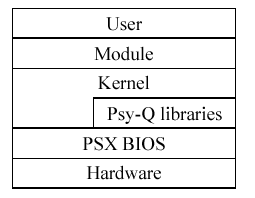

[Home](../../index.md) > [FF7](../../FF7.md) > [Kernel](../Kernel.md) > Overview

## History

The kernel is a throwback to the very first Final Fantasy game for the Nintendo's original 8 bit system. The NES could only natively read 32 kilobytes of program ROM. To get around this incredible limitation, Nintendo developed "memory mappers" that allowed parts of the program to be switched out, or "banked" and replaced with other parts stored on the game cartridge.

FF1 used Nintendo's "Memory Manager Controller \#1" (MMC1) . This controller split the game into sixteen sections, each 16 kilobytes long. (The maximum an MMC1 program could be was 256K). This controller also split the accessible memory from the cartridge into two 16K sections. The top 16K was bankable. The bottom 16K could never be switched out and stayed in memory until you removed the cartridge.

The original FF1 kernel was located in this bottom 16K of memory.

First and foremost the kernel contained the main program loop. It handled all the low level functions for the game. Some of these included controlling interrupts, banking in and out the appropriate part of the game, jumping control to a particular module, playing the music, and other tasks.

As the Final Fantasy franchise grew, so did the size of the games. They all still retained the kernel/module system. During the backporting process, this did cause a few headaches. For example, Final Fantasy 6 was originally developed for the Super Nintendo. When it's menu module was banked in, it was done with electronic bank switching. The later PSX port banked the data from the CD-ROM, which caused an unexpected lag that one wasn't used to. On the PC version for FF7, them menu system was simply integrated into the main executable.

## Kernel Functionality

The Kernel is a threaded multitasking program that manages the whole system. It uses a simple software based memory manager that handles both RAM and video memory for all the modules in the game. Assisting the kernel are many statically linked Psy-Q libraries. In the case of the PC port, the Psy-Q libs were replaced with a PC equivalent. For example the SEQ player was replaced with a MIDI player, Both accomplish the same tasks, just with different formats and execution strategies. The table below is a generic representation of how the kernel sits in relation to the other aspects of the program.

