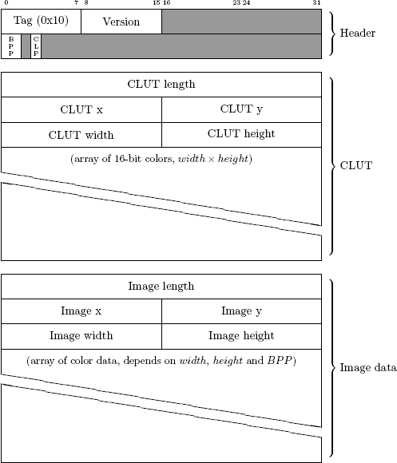
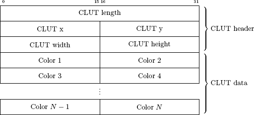
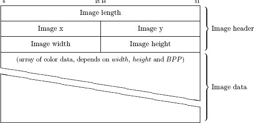
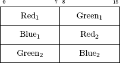

## Introduction

A TIM file is a standard image file format for the [Sony PlayStation](PSX "wikilink"). The file structure closely mimics the way textures are managed in the [frame buffer](PSX/frame_buffer "wikilink") by the [GPU](PSX/GPU "wikilink"). TIM files are [little endian](../Little_endian.md)-based.

  

## File layout

A TIM file is made up of three conceptual blocks; the header, the color lookup table (CLUT) and the image data. The CLUT block and the image data block have the same basic layout and are also treated the same way when loading a TIM file into the PlayStation frame buffer. Also, the CLUT block is optional and technically does not need to be present, even when the image data consists of color indices. Such image data is assumed to refer to *some* color lookup table, but not necessarily one stored in the same TIM file. In almost all cases though, the CLUT is included in the same TIM file as the image data using it and can thus be assumed to be applicable.

  

  
  

## Header

The header starts with a 'tag' byte; this value is constant for all TIM files and must be 0x10. The immediately following byte denotes the version of the file format. At present, only version '0' TIM files are known to exist.

The next 32-bit word contains specific flags denoting the basic properties of the TIM file. The BPP (Bits Per Pixel) value denotes the bit depth of the image data, according to the following values:

**`00`**`  4-bit (color indices)`  
**`01`**`  8-bit (color indices)`  
**`10`**`  16-bit (actual colors)`  
**`11`**`  24-bit (actual colors)`

The CLP (Color Lookup table Present) flag simply denotes whether the CLUT block is present in the TIM file. This flag is typically set when BPP is 00 or 01, and cleared otherwise.

  

## CLUT (color lookup table)

The CLUT starts with a simple 32-bit word telling the length, in bytes, of the entire CLUT block (including the header). Following that is a set of four 16-bit values telling how the CLUT data should be loaded into the frame buffer. These measurements are in frame buffer pixels, which are 16-bit. Each CLUT is stored in a rectangular portion of the frame buffer, which is typically 16 or 256 pixels wide (corresponding to 4-bit or 8-bit color indices). The rows define one or more 'palettes' which can be selected at runtime to use when drawing a color-indexed image.

  

  
The length of the CLUT data is always *width* � *height* � 2 bytes, precisely the amount of data needed to fill a rectangular area of *width* � *height* pixels in the frame buffer. Also, the x coordinate of the CLUT needs to be an even multiple of 16, but the y coordinate can be any value between 0-511. Typically they are stored directly under the front/back buffers. Each 16-bit value is interpreted as real color frame buffer pixels, which have the following format:

  

  
The red, green and blue samples behave like any RGB-defined color, but the STP (special transparency processing) bit has varying special meanings. Depending on the current transparency processing mode, it denotes if pixels of this color should be treated as transparent or not. If transparency processing is enabled, pixels of this color will be rendered transparent if the STP bit is set. A special case is black pixels (RGB 0,0,0), which **by default** are treated as transparent by the PlayStation *unless* the STP bit is set.

  

## Image data

The image block is structurally identical to the CLUT block and is processed in exactly the same way when loaded into the frame buffer. It starts with a 32-bit word telling the length, in bytes, of the entire image block, then has 4 16-bit values containing the frame buffer positioning information. After that follows the image data, which is always *width* � *height* � 2 bytes long. It is important to realize that the image measurements are in 16-bit frame buffer pixels, which does not necessarily correspond to the size of the contained image. It may help to visualize the entire image data as a *width* � *height* array of 16-bit values, which is then interpreted differently depending on color mode (this is exactly how the PlayStation treats it). To calculate the actual image dimensions, it is thus necessary to take into account the current BPP value (bits per pixel).

  

  
The image data, while loaded straight into the frame buffer, is structured differently depending on the bit depth of the image. To a TIM file reader, the image data is parsed as a series of 16-bit values with varying interpretations. The most straight-forward interpretation is for 16-bit images (BPP = **10**), in which case the image data has the same format as the frame buffer pixels themselves:

  

  
The PlayStation is also capable of handling data in 24-bit color (BPP = **11**), in which case the color samples are stored as 3-byte groups. In the event that an image's width is an uneven number of pixels, the last byte is left as padding; the first pixel of a new row is always stored at the corresponding first pixel of the frame buffer row. The color samples are stored in the following order:

  

  
Apart from the two "real" color modes, the PlayStation frequently utilizes color indexed images via CLUTs (color lookup tables). Whenever an image with color index data is drawn to the screen, a reference to a CLUT is included and the color indices get replaced with the corresponding value in the table. For 8-bit indexed colors (BPP = **01**), the image pixels are stored two by two in each 16-bit value as follows:

  

  
These images are used in conjuction with a 256-pixel CLUT. For less color-rich images, 4-bit index colors (BPP = **00**) are also available, for use with a 16-pixel CLUT. These pixels are stored four by four in each 16-bit value:

  

  
